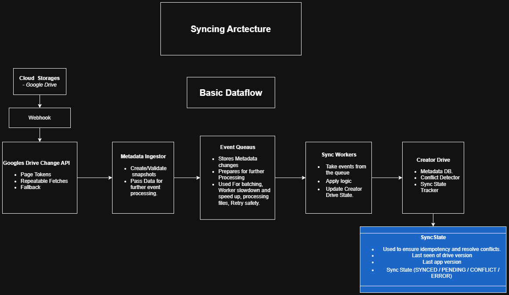
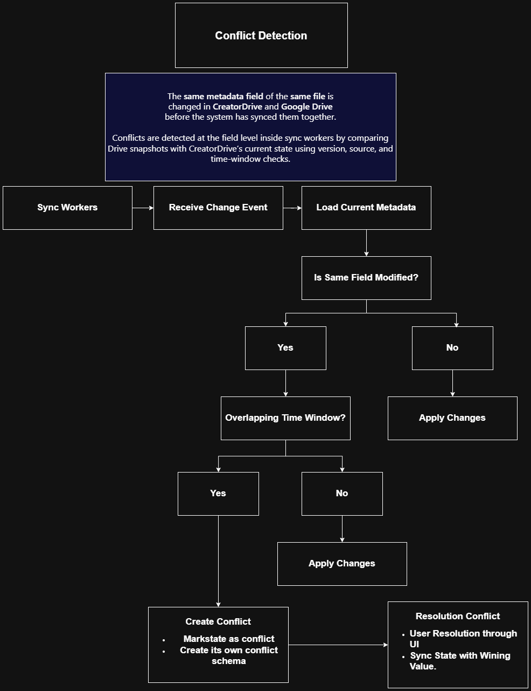
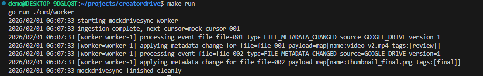

# Mockdrivesync
`Mockdrivesync` is a **conceptual system design and Go skeleton** that demonstrates how
**asynchronous, bidirectional metadata synchronization with Google Drive** could be built
at scale.

---

## Purpose

Teams managing large Google Drive libraries (tens of thousands of files)
often struggle with:

- Asynchronous updates
- Conflicting edits across systems
- API rate limits
- Reliability and observability

`Mockdrivesync` explores how a system like **CreatorDrive** could act as a
**control and collaboration layer** on top of Google Drive **without moving files**
or changing existing workflows.

---

## Design Goals

- Mirroring Metadata from Google drive to the creator drive databases.
- Safe and predictable bidirectional sync.
- Solving Challenge of conflicts, for app/drive change in metadata state.
- Reliable API design for getting data from Google API with batching, smart change detection, backoff and failure recovery.
- Cursor‑based incremental sync
- Immutable metadata snapshots
- Idempotent, stateless workers
- Explicit conflict detection (no silent merges)

---

## High‑Level Architecture

### Sync flow diagram.

Webhooks plus Google Changes API will work together to limit API calls.
> Webhooks trigger fetch.  
> The Changes API defines truth.

### Conflict flow diagram.

---

## Core Components

### Metadata Ingestor
- Owns Google Drive change cursors(Page tokens).
- Fetches authoritative metadata.
- Normalizes Drive fields into snapshots
- Emits internal change events

---

### Event Queue
- Buffers spikes in Drive activity
- Enables retries and replay
- Decouples ingestion from processing
- Allows horizontal scaling

---

### Sync Workers
- Stateless and idempotent
- Consume events asynchronously
- Compare Drive snapshots with local state
- Apply safe changes
- Detect field‑level conflicts
- Execute conflict resolutions

---

## Conflict Detection & Resolution

Conflicts occur when the **same metadata field** is modified in
both Google Drive and the application before sync convergence.

### Conflict detection
- Happens inside sync workers
- Field‑level (not file‑level)
- Uses source, version, and time window checks

### Conflict resolution
- Decision is made by a user or policy
- Resolution is emitted as a new event
- Sync workers execute the chosen outcome
- No silent overwrites

---

## Reverse Sync (Application → Google Drive)

- User actions generate **change intents**
- Intents are queued asynchronously
- Drive updates are:
  - Batched
  - Rate‑limited
  - Retryable

---
## Implementation Walkthrough
This repository includes a fully runnable mock implementation that simulates
Google Drive metadata synchronization end‑to‑end.

The flow demonstrated in code:

- A mock Google Drive client simulates the Changes API

- The ingestor fetches changes using a cursor

- Changes are converted into internal events

- Events are published to an in‑memory queue

- A sync worker consumes events and applies metadata updates

- The system shuts down cleanly after processing all events

This mirrors how a production system would behave, without relying on external APIs.

## Results
### Sync Mock Screenshot

